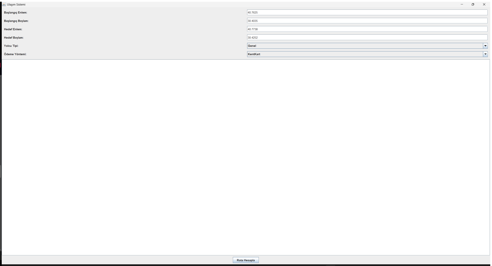
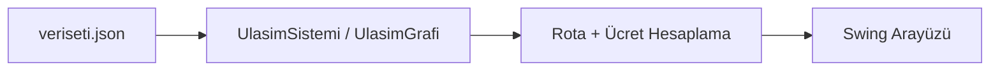

# Ulaşım Ücret ve Rota Hesaplama Sistemi

İki konum arasında toplu taşıma (otobüs, tramvay) ve taksiyi bir arada değerlendirerek en uygun rotayı, süreyi ve ücreti hesaplayan bir Java masaüstü uygulaması.



## Mimari



## Özellikler

- Duraklar arası graf tabanlı rota hesaplama (`UlasimGrafi`, `Rota`, `RotaSegmenti`)
- Başlangıç/hedef konuma en yakın durağa yürüme veya taksiyle ulaşım (son/ilk km problemi)
- Araç tipine göre ücret ve süre hesaplama:
  - Otobüs (3.0 TL/km), Tramvay (2.5 TL/km), Taksi (10 TL açılış + 4.0 TL/km)
- Yolcu tipine göre indirim (Strateji + kalıtım ile):
  - Öğrenci: otobüs/tramvayda %50 indirim
  - Yaşlı: ilk 20 kullanım ücretsiz, sonrasında %50 indirim
  - Genel: indirimsiz
- Ödeme yöntemleri (Strateji deseni): Nakit, Kredi Kartı, KentKart
- Swing tabanlı grafik arayüz: enlem/boylam girişi, yolcu/ödeme tipi seçimi, sonuç ekranı

## Teknoloji

- Java (Swing GUI)
- [org.json](https://github.com/stleary/JSON-java) (`lib/json-20250107.jar`) — JSON ayrıştırma

## Veri

`veriseti.json` dosyasında duraklar (id, isim, tip, enlem/boylam, son durak bilgisi) tanımlıdır.

## Çalıştırma

```bash
javac -cp lib/json-20250107.jar Main.java -d out
java -cp "out;lib/json-20250107.jar" Main
```

Arayüzde varsayılan enlem/boylam değerleriyle "Rota Hesapla" butonuna basarak örnek bir rota/ücret hesaplaması görebilirsiniz.

(Linux/macOS'ta classpath ayracı `;` yerine `:` kullanılır.)
