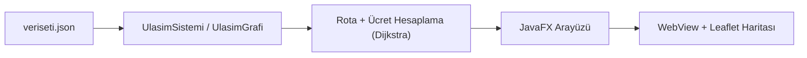

# Ulaşım Ücret ve Rota Hesaplama Sistemi

İki konum arasında toplu taşıma (otobüs, tramvay) ve taksiyi bir arada değerlendirerek en uygun rotayı, süreyi ve ücreti hesaplayan bir JavaFX masaüstü uygulaması. Gömülü bir Leaflet/OpenStreetMap haritası üzerinden başlangıç/hedef noktası seçilebilir ve hesaplanan rota harita üzerinde çizilir.

> Not: `screenshot.png` eski Swing arayüzüne ait, güncel değil. Yeni arayüzün ekran görüntüsünü aldıktan sonra bu dosyayı değiştirip yukarıdaki notu kaldırabilirsiniz.

## Mimari


```mermaid
flowchart LR
    J[veriseti.json] --> SYS["UlasimSistemi / UlasimGrafi"]
    SYS --> HESAP["Rota + Ücret Hesaplama (Dijkstra)"]
    HESAP --> UI[JavaFX Arayüzü]
    UI --> HARITA["WebView + Leaflet Haritası"]
```

## Özellikler

- Duraklar arası graf tabanlı rota hesaplama (`UlasimGrafi`, `Rota`, `RotaSegmenti`, `Dijkstra`)
- Başlangıç/hedef konuma en yakın durağa yürüme veya taksiyle ulaşım (son/ilk km problemi)
- Araç tipine göre ücret ve süre hesaplama:
  - Otobüs (3.0 TL/km), Tramvay (2.5 TL/km), Taksi (10 TL açılış + 4.0 TL/km)
- Yolcu tipine göre indirim (Strateji + kalıtım ile):
  - Öğrenci: otobüs/tramvayda %50 indirim
  - Yaşlı: ilk 20 kullanım ücretsiz, sonrasında %50 indirim
  - Genel: indirimsiz
- Ödeme yöntemleri (Strateji deseni): Nakit, Kredi Kartı, KentKart
- JavaFX arayüzü: kart tabanlı rota sonuçları, haritadan nokta seçme, hesaplanan rotanın harita üzerinde araç tipine göre renkli çizilmesi
- Adres/yer adıyla arama (OpenStreetMap Nominatim ile geocoding) — enlem/boylam bilmeden başlangıç ve hedef girilebilir

## Teknoloji

- Java 21+ / JavaFX 26 (`javafx-controls`, `javafx-web`)
- [org.json](https://github.com/stleary/JSON-java) — JSON ayrıştırma
- [Leaflet](https://leafletjs.com/) + OpenStreetMap — harita (yerel olarak paketlenmiş, `src/main/resources/map`)
- [Nominatim](https://nominatim.org/) — adres arama (OpenStreetMap'in ücretsiz geocoding servisi)
- Maven (Maven Wrapper ile, ayrıca kurulum gerekmez)

## Veri

`src/main/resources/veriseti.json` dosyasında duraklar (id, isim, tip, enlem/boylam, son durak bilgisi) tanımlıdır.

## Çalıştırma

En kolay yol, proje köküne çift tıklamak:

```
start.bat
```

Bu, Maven Wrapper üzerinden bağımlılıkları indirir (ilk çalıştırmada internet gerekir), derler ve uygulamayı açar.

Elle çalıştırmak isterseniz:

```bash
mvnw.cmd package
java -cp "target\classes;target\dependency\*" com.ulasim.hesaplama.Launcher
```

> Not: `mvn javafx:run` bu projede kasıtlı olarak kullanılmıyor — JDK 26 artık `jdk.jsobject` modülünü içermiyor ve `javafx-maven-plugin` 0.0.8 bunun yerine geçen `org.openjfx:jdk-jsobject` bağımlılığını module path'e değil classpath'e koyduğu için `javafx:run` bu ortamda çalışmıyor. Bunun yerine bağımlılıklar `target/dependency`'ye kopyalanıp uygulama düz classpath ile (`Launcher` sınıfı üzerinden, `Application` alt sınıfını doğrudan çalıştırmanın JavaFX'in "runtime components missing" kontrolünü tetiklememesi için) başlatılıyor.

Arayüzde varsayılan enlem/boylam değerleriyle "Rota Hesapla" butonuna basabilir, "Haritadan Seç" ile haritaya tıklayabilir ya da başlangıç/hedef arama kutularına bir adres/yer adı yazıp Enter'a basabilirsiniz. Harita altlığı (OpenStreetMap kaplamaları) ve adres arama (Nominatim) için çalışma anında internet bağlantısı gerekir.
